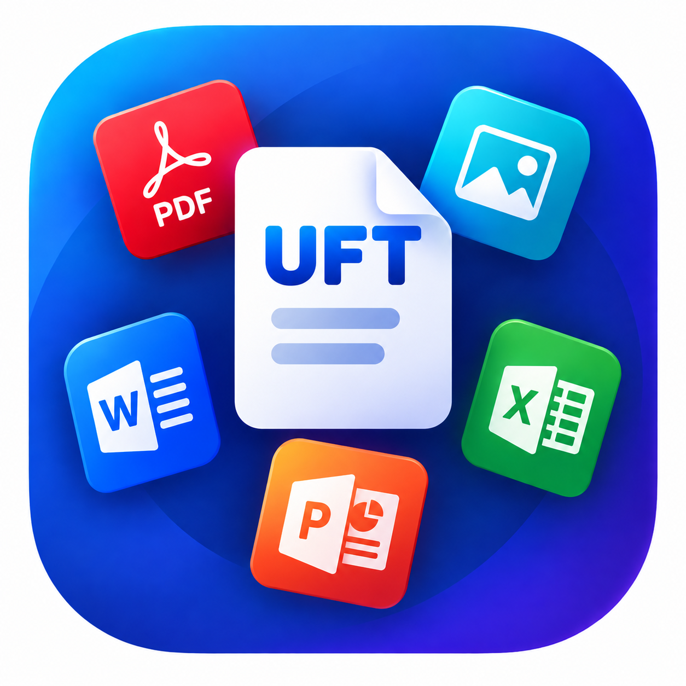

<p align="center">
  
</p>

<h1 align="center">Universal File Toolkit & Claude Connector</h1>

<p align="center">
  <strong>The Ultimate All-in-One File Processing Engine, Web Application, and Claude Desktop MCP Suite</strong>
</p>

<p align="center">
  <a href="https://uftapp.onrender.com"></a>
  <a href="https://github.com/Irfanpathan21/Universal-File-Claude-Connector/releases/latest/download/UniversalFileToolkit-Setup.zip"></a>
  <a href="https://github.com/Irfanpathan21/Universal-File-Claude-Connector/releases"></a>
</p>

<p align="center">
  <a href="LICENSE"></a>
  <a href="https://modelcontextprotocol.io/"></a>
  <a href="#-tool-directory-100-tools"></a>
  
</p>

---

## 🎯 Overview

**Universal File Toolkit** provides an enterprise-grade, all-in-one file processing suite for **100+ file transformations** across PDFs, Images, Spreadsheets, Word documents, PowerPoints, Archives, OCR, and Data formats.

Use it across 3 powerful modalities:
1. 🌐 **Live Hosted Web App**: [https://uftapp.onrender.com](https://uftapp.onrender.com) (No installation required, in-browser execution)
2. 💻 **Windows Desktop Application**: Native standalone application package with Start Menu search and isolated app window.
3. 🤖 **Claude Desktop MCP Connector**: Extends Claude Desktop PC & Claude Web (`claude.ai`) with 100 direct file manipulation tools.

### ✨ Key Features
- 🛡️ **Strict File Type Validation**: Both frontend UI dropzones and backend processing endpoints strictly validate file extensions and MIME types. PDF tools only accept `.pdf`, image tools accept only valid image types, etc., eliminating format mismatch errors.
- ⚡ **1-Click Setup (`Setup.bat`)**: Single, straightforward setup script that configures dependencies, builds engines, and creates shortcuts automatically.
- 🔍 **Windows Search Integration**: Desktop application registers automatically into Windows Start Menu and Desktop.

---

## 📦 Quick Downloads & Installation

### Option 1: Download Windows Desktop App (1-Click Setup)

1. **Download the Package**: [**Download `UniversalFileToolkit-Setup.zip`**](https://github.com/Irfanpathan21/Universal-File-Claude-Connector/releases/latest/download/UniversalFileToolkit-Setup.zip) *(or direct from repository: [`UniversalFileToolkit-Setup.zip`](UniversalFileToolkit-Setup.zip))*
2. **Extract & Run**:
   - Extract the `.zip` archive to any folder.
   - Double-click **`Setup.bat`**.
3. **What Setup Does Automatically**:
   - 🔍 Checks and installs Node.js LTS (via winget if missing).
   - 📦 Installs all project dependencies via pnpm.
   - 🔨 Builds the backend processing engines and compiles TypeScript packages.
   - 🖥️ Creates **Desktop Shortcut** with official app icon.
   - 🔍 Registers into **Windows Start Menu** — search **"Universal File Toolkit"** anytime.
   - 🌐 Launches the app in a dedicated Chrome / Edge App Mode window.
   - 🔌 **Auto-Configures Claude Desktop**: Automatically connects all 100 tools to Claude Desktop MCP (`claude_desktop_config.json`) if Claude is installed!

---

### Option 2: Run Live on the Web (Zero Installation)

Open **[https://uftapp.onrender.com](https://uftapp.onrender.com)** to run all tools directly in your browser. All file transformations (PDF merge/split/rotate, image resize/crop/convert, JSON/CSV/data parsing, hashing) execute directly in memory with real processing engines.

---

### Option 3: Developer & Claude MCP Setup

To run from source or configure Claude Desktop manually:

```bash
# Clone the repository
git clone https://github.com/Irfanpathan21/Universal-File-Claude-Connector.git
cd Universal-File-Claude-Connector

# Install dependencies and build
npm install
npm run build

# Start services
npm run start:web
```

#### Connect to Claude Desktop (`claude_desktop_config.json`):
```json
{
  "mcpServers": {
    "universal-file-toolkit": {
      "command": "node",
      "args": [
        "C:\\FULL\\PATH\\TO\\Universal-File-Claude-Connector\\packages\\mcp-server\\dist\\index.js"
      ]
    }
  }
}
```

---

## 🛠️ Tool Directory (100 Tools Across 11 Categories)

See [`docs/AVAILABLE_TOOLS.md`](docs/AVAILABLE_TOOLS.md) for full documentation of all 100 tools:

| Category | Tools | Capabilities |
| :--- | :---: | :--- |
| **📄 PDF Toolkit** | **28** | Merge, split, compress, rotate, watermark, page numbering, protect/unlock, insert/delete/swap/rearrange pages, edit metadata, form flattening, PDF ↔ Images, PDF ↔ TXT, crop, resize |
| **🖼️ Image Toolkit** | **21** | Resize, crop, rotate, flip, compress, format convert (PNG/JPG/WebP/GIF), blur, sharpen, EXIF strip, thumbnails, invert, gamma, threshold, dominant colors, trim transparent edges |
| **📈 Excel & Spreadsheets** | **12** | Excel ↔ CSV, Excel ↔ JSON, Excel ↔ HTML, deduplication, sheet merging, transpose, password protection, split workbook, search & replace, statistics |
| **📊 Data Interchange** | **12** | JSON ↔ CSV, JSON ↔ XML, JSON ↔ YAML, Markdown ↔ HTML, formatting, minification |
| **📝 Word Documents** | **10** | Extract text/images/links, DOCX ↔ HTML, DOCX ↔ Markdown, TXT ↔ DOCX, merge DOCX, replace text, extract comments, word count |
| **🖥️ PowerPoint Presentations** | **6** | Extract slide text, speaker notes, images, PPTX ↔ PDF, PPTX ↔ HTML, metadata extraction |
| **📦 Archives & Compression** | **5** | Create ZIP, Extract ZIP, List contents, GZIP compress, GZIP decompress |
| **🤖 AI Document Intelligence** | **3** | Text summarization, keyword extraction, sentiment analysis |
| **🔍 OCR Text Extraction** | **1** | Tesseract OCR engine for PNG, JPG, and TIFF scans |
| **🔒 Checksum & Security** | **1** | Multi-algorithm cryptographic hash generator (MD5, SHA-1, SHA-256, SHA-512) |
| **✍️ Text Analytics** | **1** | Word count, character count, readability metrics, reading time |
| **Total** | **100** | |

---

## 💻 Tech Stack

- **Frontend**: React 18, Vite 5, Tailwind CSS, Radix UI, Framer Motion, `pdf-lib`
- **Backend API**: Fastify, TypeScript, Sharp, ExcelJS, Mammoth, Archiver, Tesseract
- **MCP Server**: Official Model Context Protocol SDK (`@modelcontextprotocol/sdk` v1.x)
- **Windows Executables**: C# / WPF native installer & launcher with embedded manifest & metadata

---

## ❓ Troubleshooting

### Windows SmartScreen Note

When running `Setup.bat` after downloading the zip file, Windows may show a standard SmartScreen notice (*"Windows protected your PC"*). Simply click **"More info"** and then **"Run anyway"**. Alternatively, right-click `Setup.bat` -> Properties -> check **Unblock** -> OK.

### Wrong File Type Error

All tools now validate file types before processing. If you see an error like *"PDF tools only accept .pdf files"*, it means you uploaded the wrong file format. Each tool clearly states which file types it accepts in the upload area.

---

## 📄 License

Distributed under the MIT License. See [LICENSE](LICENSE) for more information.
